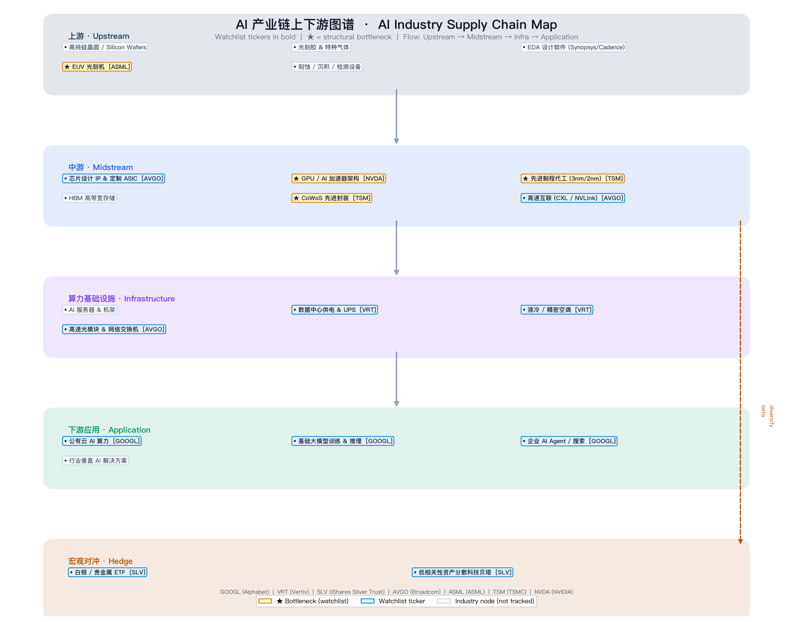

# AI Finance & Statistics Hub

[](LICENSE)

**Problem:** Investors and analysts need one place to monitor an AI supply-chain watchlist, understand upstream/downstream bottlenecks, run rigorous return diagnostics, and apply correct statistical tests-with client-ready PDF output.

**Solution:** An integrated Python demo merging [financial-analysis-demo](https://github.com/bobooooo6868/financial-analysis-demo) with [stats-inference-toolkit](https://github.com/LIUYOUCecilia/stats-inference-toolkit), plus a rich **AI supply-chain map** explaining where each ticker sits in the value chain.

**Result:** A portfolio-ready repo with CLI, unified Streamlit dashboard, supply-chain diagram, offline demo fallback, pytest + CI, and basket-level inference.

## AI Supply Chain Map



See [docs/AI_SUPPLY_CHAIN.md](docs/AI_SUPPLY_CHAIN.md) for details (includes a Mermaid flow diagram).

## Watchlist (7 tickers)

| Ticker | Role | Layer |
|--------|------|-------|
| **ASML** | * **Upstream bottleneck** - EUV lithography monopoly | Upstream equipment |
| **TSM** | * **Midstream bottleneck** - advanced foundry & CoWoS packaging | Midstream foundry |
| **NVDA** | * **Downstream bottleneck** - AI GPU compute (CUDA) | Compute silicon |
| **AVGO** | Custom AI ASIC, networking & high-speed interconnect | Silicon / interconnect |
| **VRT** | Data-center power, cooling & rack infrastructure | Infrastructure |
| **GOOGL** | AI cloud, foundation models & enterprise AI | Downstream application |
| **SLV** | Precious-metal hedge / macro diversifier | Macro hedge |

## Highlights

| Module | Features |
|--------|----------|
| **Supply Chain Map** | Layered upstream-to-application diagram, bottleneck markers, node glossary |
| **Portfolio Dashboard** | yfinance fetch, correlation, rolling vol, JB/ADF tests, charts |
| **Basket Inference** | AI chain vs SLV hedge -> auto t-test/ANOVA -> PDF |

## Quick Start

```bash
cd ai-finance-stats-hub
chmod +x setup.sh && ./setup.sh --demo
streamlit run app.py
```

## Commands

| Command | Purpose |
|---------|---------|
| `python main.py --demo` | Portfolio pipeline + charts + supply-chain map |
| `streamlit run app.py` | Unified dashboard (map + portfolio + basket inference) |
| `pytest tests/` | Unit tests |

## Data Notes

- Market data via [yfinance](https://github.com/ranaroussi/yfinance) (delayed; education/research only).
- Use **Use demo data** when offline or rate-limited.

## License

MIT License
