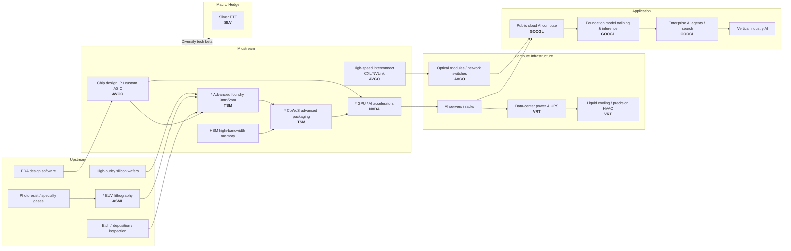

# AI Supply Chain Map

This project's watchlist covers key nodes across the AI value chain-from **upstream equipment** through **downstream applications**-with three structural bottleneck stocks highlighted.

## Overview

> Regenerate with `python main.py --demo` or `python -c "from src.finance.supply_chain_map import plot_supply_chain_map; plot_supply_chain_map()"`.

## Mermaid Flow Diagram

## Watchlist (7 tickers)

| Ticker | Company | Chain position | Bottleneck? |
|--------|---------|----------------|-------------|
| **ASML** | ASML | Upstream - EUV lithography equipment | * Global monopoly on advanced-node equipment |
| **TSM** | TSMC | Midstream - advanced foundry & CoWoS packaging | * High-end AI chip capacity constraint |
| **NVDA** | NVIDIA | Midstream/downstream - GPU compute | * CUDA ecosystem + HBM bandwidth |
| **AVGO** | Broadcom | Midstream - custom ASIC & high-speed interconnect | Key silicon / networking node |
| **VRT** | Vertiv | Infrastructure - power & cooling | AI data-center necessity |
| **GOOGL** | Alphabet | Downstream - cloud + foundation models | Application-layer representative |
| **SLV** | Silver ETF | Macro hedge | Low-correlation diversifier |

## Three bottleneck stocks - rationale

1. **ASML (upstream)** - Sole manufacturer of production EUV lithography systems; advanced nodes (below 7nm) are nearly irreplaceable.
2. **TSM (midstream)** - Concentration of the world's most advanced foundry capacity; CoWoS packaging caps AI GPU shipments.
3. **NVDA (downstream compute)** - Leading share in AI training/inference GPUs; software stack (CUDA) creates ecosystem lock-in.

## Link to project analytics

- **Portfolio Dashboard -> Supply Chain Map**: Interactive diagram + layered node table
- **Basket Inference**: Group by upstream/midstream/downstream bottlenecks or AI chain vs SLV hedge for hypothesis tests
- **Correlation matrix**: Examine correlation structure among bottleneck names and the SLV hedge
