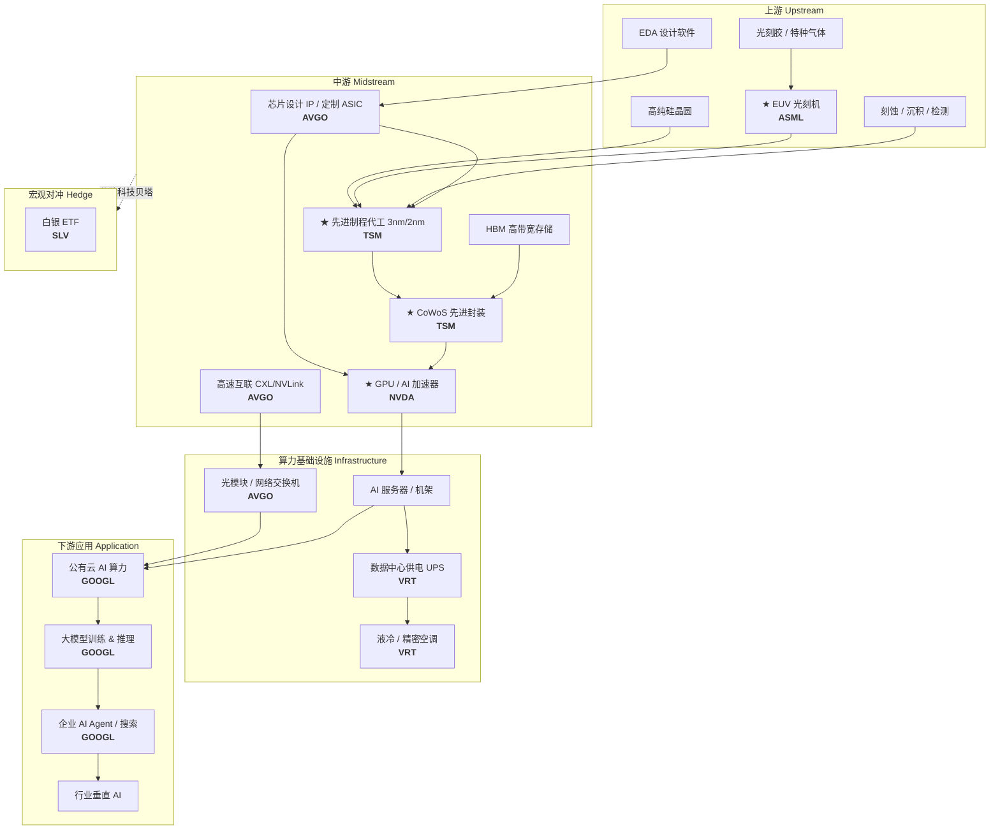

# AI 产业链上下游图谱

本项目的 watchlist 覆盖 AI 产业链从**上游设备**到**下游应用**的关键节点，并标注三大结构性瓶颈股。

## 图谱总览

> 运行 `python main.py --demo` 或 `python -c "from src.finance.supply_chain_map import plot_supply_chain_map; plot_supply_chain_map()"` 可重新生成此图。

## Mermaid 流程图

## Watchlist 标的（7 支）

| 代码 | 公司 | 产业链位置 | 是否瓶颈 |
|------|------|-----------|---------|
| **ASML** | ASML | 上游 — EUV 光刻设备 | ★ 全球先进制程设备垄断 |
| **TSM** | 台积电 | 中游 — 先进代工 & CoWoS 封装 | ★ 高端 AI 芯片产能瓶颈 |
| **NVDA** | NVIDIA | 中游/下游 — GPU 算力 | ★ CUDA 生态 + HBM 带宽 |
| **AVGO** | Broadcom | 中游 — 定制 ASIC & 高速互联 | 关键硅片/网络节点 |
| **VRT** | Vertiv | 基础设施 — 电力/散热 | AI 数据中心刚需 |
| **GOOGL** | Alphabet | 下游 — 云 + 大模型 | 应用层代表 |
| **SLV** | 白银 ETF | 宏观对冲 | 低相关性分散 |

## 三大瓶颈股逻辑

1. **ASML（上游）** — 唯一能量产 EUV 光刻机的厂商，先进制程（7nm 以下）几乎不可替代。
2. **TSM（中游）** — 全球最先进代工产能集中，CoWoS 封装决定 AI GPU 出货上限。
3. **NVDA（下游算力）** — AI 训练/推理 GPU 市占率领先，软件栈（CUDA）形成生态锁定。

## 与本项目分析的关联

- **Portfolio Dashboard → Supply Chain Map**：交互式图谱 + 分层节点表
- **Basket Inference**：可按「上游/中游/下游瓶颈」或「AI 链 vs SLV 对冲」分组做假设检验
- **相关性矩阵**：观察瓶颈股之间及与 SLV 对冲标的的相关结构
